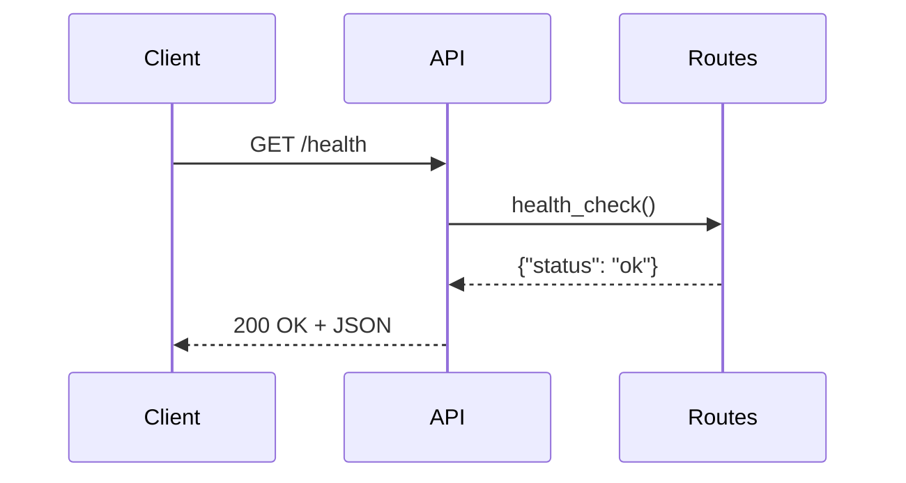
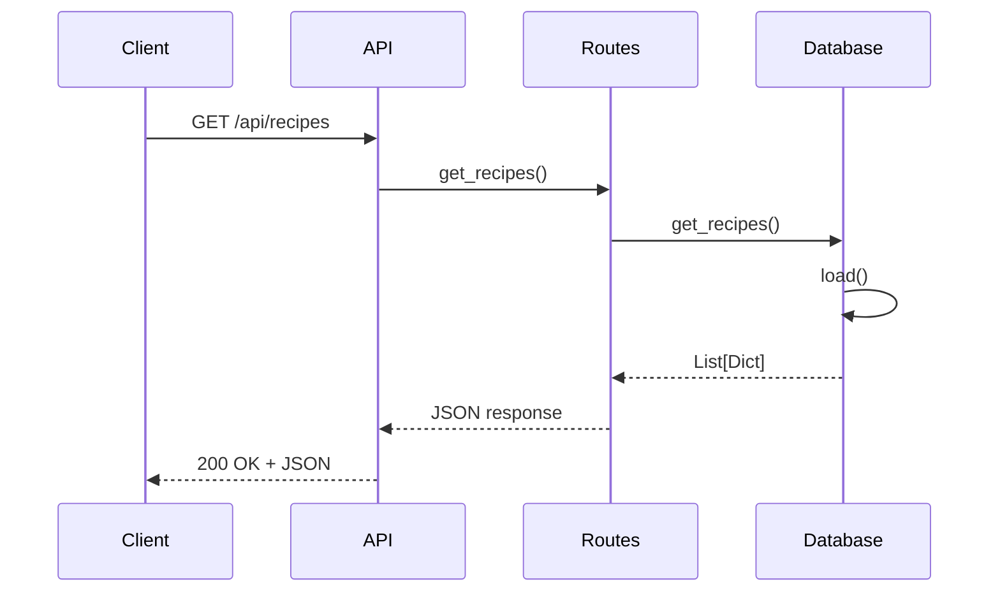
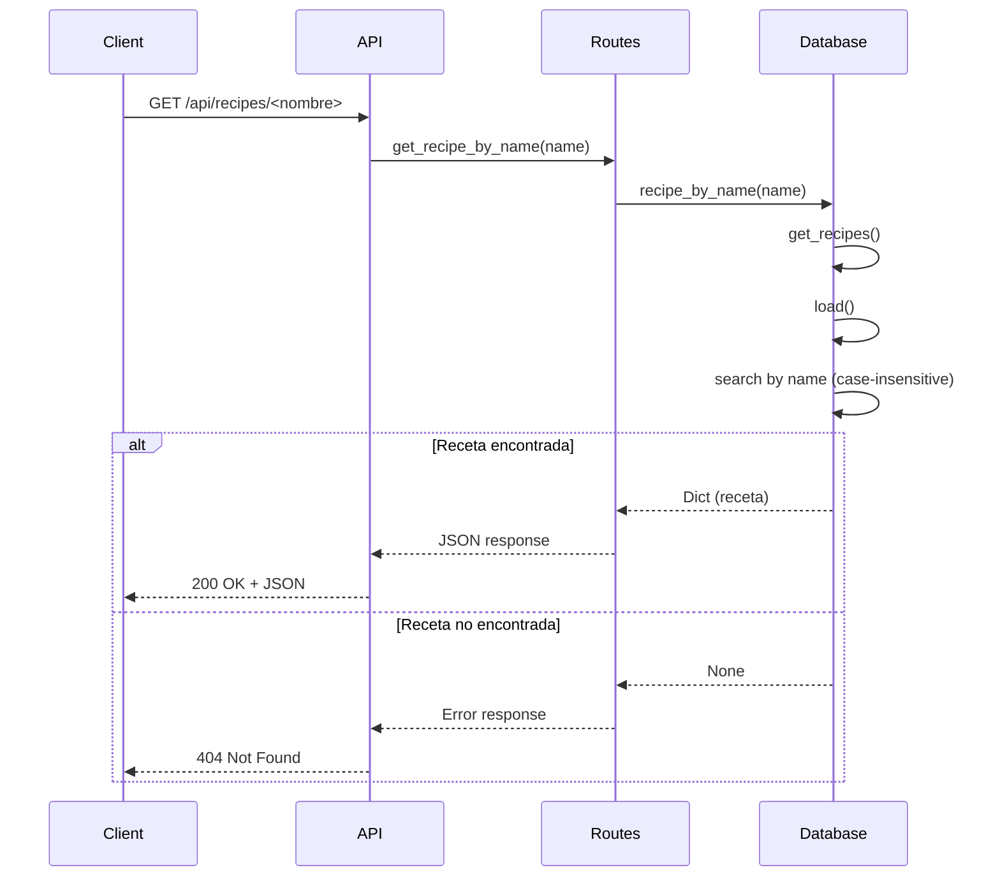
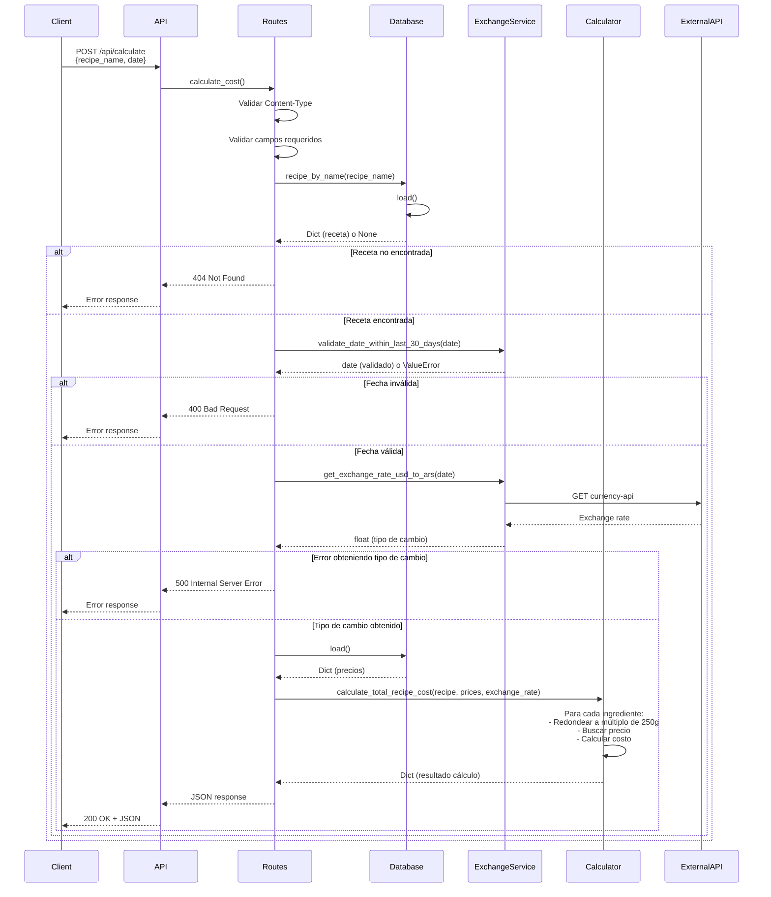

# WNS Challenge - Calculadora de Costos de Recetas

## Descripción

Aplicación web que permite calcular el costo de recetas en pesos argentinos y dólares estadounidenses, utilizando precios de carnes, pescados y verduras, y tipos de cambio históricos.

La aplicación parsea archivos de entrada (Markdown, Excel, PDF), normaliza los datos en una base de datos JSON, y expone una API REST para consultar recetas y calcular costos.

## Arquitectura

```
Archivos raw (inputs/) → [Ingesta] → JSON Database → [API REST] → Frontend
```

**Separación de responsabilidades:**
- **Ingesta**: Se ejecuta una sola vez (o cuando cambian los archivos)
- **API**: Lee desde JSON (no parsea archivos cada vez)
- **Frontend**: Consume la API (opcional)

## Instalación y Uso

### Requisitos

- **Docker y Docker Compose** (recomendado)
- O **Python 3.11+** con pip

### Opción 1: Con Docker (Recomendado)

```bash
# 1. Clonar repositorio
git clone <tu-repo>
cd WNS-Instancia-evaluativa

# 2. Levantar contenedor
docker-compose up -d

# 3. Ejecutar ingesta de datos (primera vez)
docker-compose exec api python -m src.ingest.ingest

# 4. Probar API
curl http://localhost:5001/health
```

La API estará disponible en `http://localhost:5001`

### Opción 2: Instalación Local

```bash
# 1. Crear entorno virtual
python3 -m venv venv
source venv/bin/activate  # En Windows: venv\Scripts\activate

# 2. Instalar dependencias
pip install -r requirements.txt

# 3. Ejecutar ingesta de datos
python -m src.ingest.ingest

# 4. Ejecutar API
python -m src.api.app
```

La API estará disponible en `http://localhost:5001`

## Endpoints de la API

### GET /health
Health check del servidor.

**Ejemplo:**
```bash
curl http://localhost:5001/health
```

**Respuesta:**
```json
{
  "status": "ok"
}
```

**Diagrama de Secuencia:**


---

### GET /api/recipes
Obtiene todas las recetas disponibles.

**Ejemplo:**
```bash
curl http://localhost:5001/api/recipes
```

**Respuesta:**
```json
{
  "recipes": [
    {
      "nombre": "Asado con ensalada criolla",
      "ingredientes": [
        {
          "nombre": "Asado de tira",
          "cantidad": 1000.0,
          "unidad": "g"
        },
        ...
      ]
    },
    ...
  ],
  "total": 10
}
```

**Diagrama de Secuencia:**


---

### GET /api/recipes/<nombre>
Obtiene una receta específica por nombre.

**Ejemplo:**
```bash
curl http://localhost:5001/api/recipes/Asado%20con%20ensalada%20criolla
```

**Respuesta:**
```json
{
  "nombre": "Asado con ensalada criolla",
  "ingredientes": [
    {
      "nombre": "Asado de tira",
      "cantidad": 1000.0,
      "unidad": "g"
    },
    ...
  ]
}
```

**Diagrama de Secuencia:**


---

### POST /api/calculate
Calcula el costo de una receta para una fecha específica.

**Body:**
```json
{
  "recipe_name": "Asado con ensalada criolla",
  "date": "2025-12-30"
}
```

**Ejemplo:**
```bash
curl -X POST http://localhost:5001/api/calculate \
  -H "Content-Type: application/json" \
  -d '{"recipe_name": "Asado con ensalada criolla", "date": "2025-12-30"}'
```

**Respuesta:**
```json
{
  "recipe_name": "Asado con ensalada criolla",
  "calculation_date": "2025-12-30",
  "exchange_rate_usd_to_ars": 1457.05,
  "cost_details": {
    "total_cost_ars": 7925.0,
    "total_cost_usd": 5.44,
    "details": [
      {
        "name": "Asado de tira",
        "quantity_grams": 1000.0,
        "quantity_to_buy_grams": 1000,
        "price_per_kg_ars": 6800,
        "cost_ars": 6800.0
      },
      ...
    ]
  }
}
```

**Diagrama de Secuencia:**


**Notas:**
- La fecha debe estar dentro de los últimos 30 días
- Las cantidades se redondean hacia arriba a múltiplos de 250g
- El tipo de cambio se obtiene de una API externa

## Estructura del Proyecto

```
WNS-Instancia-evaluativa/
├── src/
│   ├── parsers/              # Parsers de archivos
│   │   ├── recetas.py        # Parser de recetas Markdown
│   │   ├── precios_carnes.py # Parser de Excel (carnes/pescados)
│   │   ├── precios_verduras.py # Parser de PDF (verduras)
│   │   └── utils.py          # Funciones comunes
│   ├── database/             # Manejo de base de datos JSON
│   │   └── json_db.py        # Clase JSONDatabase
│   ├── ingest/               # Script de ingesta
│   │   └── ingest.py         # Orquesta parsers y guarda en JSON
│   ├── services/             # Lógica de negocio
│   │   ├── calculator.py     # Cálculo de costos
│   │   └── exchange_rate.py  # API de cotización
│   └── api/                  # API REST
│       ├── app.py            # Flask app factory
│       └── routes.py         # Endpoints
├── inputs/                   # Archivos de entrada
│   ├── Recetas.md
│   ├── Carnes y Pescados.xlsx
│   └── verduleria.pdf
├── database/                 # Base de datos JSON (generada)
│   └── data.json
├── Dockerfile
├── docker-compose.yml
├── .dockerignore
├── requirements.txt
└── README.md
```

## Tecnologías Utilizadas

- **Python 3.11**: Lenguaje principal
- **Flask 3.0.0**: Framework web para API REST
- **Pandas 2.1.0**: Procesamiento de archivos Excel
- **openpyxl 3.1.2**: Backend para leer archivos .xlsx
- **pdfplumber 0.9.0**: Extracción de datos de PDFs
- **requests 2.31.0**: Cliente HTTP para API de cotización
- **Docker**: Containerización de la aplicación

## Comandos Útiles

### Docker

```bash
# Construir imagen
docker-compose build

# Levantar contenedor
docker-compose up

# Levantar en background
docker-compose up -d

# Ver logs
docker-compose logs -f

# Ejecutar ingesta
docker-compose exec api python -m src.ingest.ingest

# Detener contenedor
docker-compose down

# Reconstruir después de cambios
docker-compose build --no-cache
docker-compose up
```

### Desarrollo Local

```bash
# Activar entorno virtual
source venv/bin/activate

# Ejecutar ingesta
python -m src.ingest.ingest

# Ejecutar API
python -m src.api.app

# Ejecutar tests (si existen)
python -m pytest
```

## Datos

El proyecto procesa:
- **10 recetas** en formato Markdown
- **28 precios** de carnes y pescados en Excel
- **16 precios** de verduras en PDF

Los datos se normalizan y almacenan en `database/data.json` después de ejecutar la ingesta.

## Testing

### Probar Endpoints Manualmente

```bash
# Health check
curl http://localhost:5001/health

# Obtener todas las recetas
curl http://localhost:5001/api/recipes

# Obtener receta específica
curl http://localhost:5001/api/recipes/Asado%20con%20ensalada%20criolla

# Calcular costo
curl -X POST http://localhost:5001/api/calculate \
  -H "Content-Type: application/json" \
  -d '{"recipe_name": "Asado con ensalada criolla", "date": "2025-12-30"}'
```

## Características

- Parsing de múltiples formatos (Markdown, Excel, PDF)
- Base de datos JSON normalizada
- API REST con validaciones
- Cálculo de costos con redondeo a múltiplos de 250g
- Integración con API de tipo de cambio
- Validación de fechas (últimos 30 días)
- Dockerizado para fácil deployment
- Manejo de errores robusto

## Detalles Técnicos

### Redondeo de Cantidades
Las cantidades se redondean hacia arriba al múltiplo de 250g más cercano:
- 800g → 1000g (porque 750g es menos, 1000g es el siguiente)
- 250g → 250g (ya es múltiplo)
- 251g → 500g (redondea hacia arriba)

### Tipo de Cambio
El tipo de cambio se obtiene de:
```
https://cdn.jsdelivr.net/npm/@fawazahmed0/currency-api@[FECHA]/v1/currencies/usd.json
```

La fecha debe estar en formato `YYYY-MM-DD` y dentro de los últimos 30 días.

## Troubleshooting

### Error: Puerto 5001 en uso
```bash
# Ver qué proceso usa el puerto
lsof -i :5001

# O cambiar el puerto en docker-compose.yml
ports:
  - "5002:5001"
```

### Error: JSON corrupto
La aplicación maneja automáticamente JSON corrupto, retornando una estructura por defecto.

### Error: Archivo no encontrado
Asegúrate de que los archivos en `inputs/` existan antes de ejecutar la ingesta.

## Licencia

Este proyecto fue desarrollado como parte de un challenge técnico.

## Autor

Desarrollado como parte del WNS Challenge.

---

**Nota**: Este proyecto requiere ejecutar la ingesta de datos antes de usar la API. Ver sección "Instalación y Uso" para más detalles.

